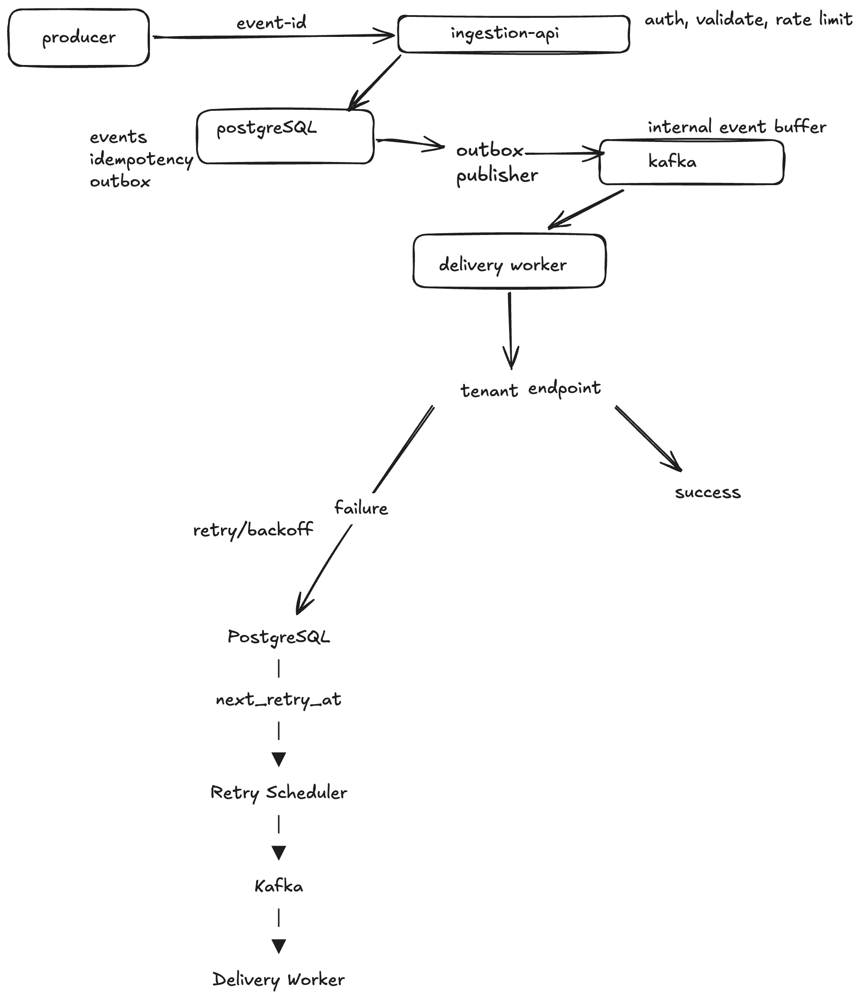

# Architecture

## Overview

webhook-reliability delivers events from a producer to a tenant's webhook
endpoint with at-least-once delivery, idempotent ingestion, exponential
backoff on retry, per-tenant rate limiting, and a durable attempt history
that an AI ops assistant can later read from to investigate failures and
recommend safe replays.




## Components

### Producer
External system that owns the events. 

### Ingestion API
Public HTTP Endpoints:
- `POST /api/v1/sources` - Register a webhook source
- `POST /api/v1/events/{sourceId}` - Receive events from providers

Responsible for:
- extracting idempotency key from event body (via JSONPath) or HTTP header (based on source config)
- deduplicating events (same source + idempotency key = skip)
- generating the platform's own event identifier (UUID)
- writing the event to Postgres


### PostgreSQL — events, idempotency, outbox, deliveries, retry schedule

**Why consolidated:** the outbox publisher and the retry scheduler are
structurally the same kind of component, both poll a table on a
schedule and publish to Kafka. And it lets this table act both as an Idempotency store and 
the delivery-attempt audit trail the AI ops assistant reads from.


### Outbox publisher
Polls the outbox table and publishes to Kafka, partitioned by tenant ID.

**Why this exists:**  the classic dual-write problem, solved by never
attempting the dual write.

### Kafka
Internal event buffer.
Topic partitioned by tenant ID, which gives per-tenant ordered delivery. 

### Delivery Worker
Consumes from Kafka. Calls the tenant endpoint over HTTPS using the
`webhook-id` header established at ingestion, unchanged across every
retry of that event.

### Tenant Endpoint
External, tenant-owned HTTP receiver. 

### Retry Scheduler
Polls Postgres for rows past their `next_retry_at`, re-publishes them to
Kafka so the delivery worker picks them up again.

## Key decisions

- Ingestion idempotency uses the event ID the source already sends.
- **`webhook-id`** (platform-generated UUIDv7) is a separate concern from
  the key above — it's what the *tenant* uses for their own idempotent
  processing of deliveries, assigned once at ingestion and reused
  unchanged across every retry. UUIDv7 is time-ordered, which lets the
  outbox publisher and retry scheduler query "oldest due" efficiently
  without a separate timestamp index.
- Outbox publisher concurrency: SELECT ... FOR UPDATE SKIP LOCKED, not a manual 
  locked_by column. Multiple publisher instances can run at once — each grabs a
  batch of unpublished rows and locks them; other instances skip those rows instead 
  of waiting, so no two instances publish the same row. If an instance crashes 
  mid-batch, Postgres releases its locks automatically and another instance picks the 
  rows back up.
- **One consolidated Postgres store** instead of separate physical
  stores for idempotency, outbox, deliveries, and retry schedule.
- **Kafka topic partitioned by tenant ID** for ordered per-tenant
  delivery.
- Add tenant-level backpressure: track a rolling failure count per tenant, and once it
  crosses a threshold, stretch that tenant's backoff further instead of retrying on 
  the normal schedule, resetting the counter on the next successful delivery.
- Add jitter, batch limits, and tenant-level backpressure to the retry scheduler: cap how many due rows it
  pulls per poll, randomize each row's retry delay slightly so a burst of failures 
  doesn't all wake up at once, and track a rolling failure count per tenant so a 
  consistently-failing endpoint gets a longer backoff instead of retrying on the 
  normal schedule, resetting the moment a delivery succeeds.


See `docs/decisions/` for the reasoning behind individual choices once
those are written up as ADRs.


## Ingestion Flow

### 1. Register webhook source

```
POST /api/v1/sources
{
  "name": "Stripe",
  "eventIdSource": "BODY",
  "eventIdPath": "$.id",
  "destinationUrl": "https://customer.com/webhooks"
}

Response:
{
  "sourceId": "550e8400-e29b-41d4-a716-446655440000",
  "webhookUrl": "https://api.example.com/api/v1/events/550e8400-e29b-41d4-a716-446655440000"
}
```

`eventIdSource` determines where the idempotency key is extracted from:
- `BODY` - extract from JSON body using JSONPath (e.g., `"eventIdPath": "$.id"`)
- `HEADER` - extract from HTTP header (e.g., `"eventIdPath": "X-Idempotency-Key"`)

### 2. Configure webhook URL in provider

Customer configures the `webhookUrl` in their provider (Stripe, GitHub, etc).

### 3. Provider sends event

```
POST /api/v1/events/{sourceId}
{
  "id": "evt_456",
  "type": "payment_intent.succeeded",
  "data": { ... }
}
```

### 4. Ingestion service processes event

1. Fetch Source config from DB
2. Extract idempotency key based on `eventIdSource`:
   - If `BODY` → use JSONPath on request body (e.g., `$.id` → `"evt_456"`)
   - If `HEADER` → read from HTTP header (e.g., `X-Idempotency-Key`)
3. Check if event exists (source_id + idempotency_key)
4. If duplicate → return 202 (idempotent)
5. If new → save to `events` table, return 202

